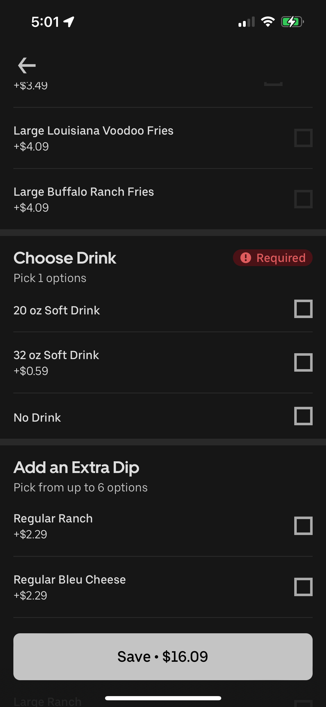

# When Hunger Meets Confusion

**By Tyler Rodgers** 
November 21, 2024

Earlier this week, I decided to order dinner using the Uber Eats delivery app. I was craving some wings, but I was not entirely sure from where. My goal was to browse local restaurants and fast food to find something that looked good to me, and then place an order. After a few minutes of scrolling through Uber Eats, I found Wingstop. I found a "8pc Wing Combo Meal" which included 8 wings (two flavors), a side, a dressing, and a drink. I found my order.

After selecting the meal the app guided me through customization steps. First I chose two flavors for the wings. Next I picked fries for the side, and ranch as the dressing. Finally I tried to select a drink. This is where things went wrong. The drink selection box would not respond. No matter how many times I tapped it, the app would not let me choose a drink. And without a drink selection, the app would not let me proceed to checkout.

In the wingstop menu, the interface looked like this:

I tried backing out and reselecting the meal, refreshing and restarting the app, but nothing worked. I realized I could not complete my order and was frustrated. The meal I wanted was unattainable. After spending over 15 minutes trying to order and fix the issue, I gave up. I closed the app and drove to Chipotle instead. While Chipotle was not what I initially wanted, I knew I could rely on their in store ordering process.

This experience showed some good qualities about the app and also some major flaws. When it comes to **effectiveness**, the app made it easy to find Wingstop and explore their menu which shows the browsing and meal customization are well designed. However the drink selection glitch completely ruined the effectiveness of my interaction. For a food app, failing at the final step of placing an order is a major fail in effectiveness. 

In terms of **efficiency** the app started off good but ended poorly. I was able to find Wingstop and navigate their menu very quickly. I was also able to customize my order quickly as it was very intuitive. However, the drink selection issue turned a quick 5 minute process into a 15 minute long frustrating process. Because this took me a long time to try and figure out I would say that it was not efficient and wasted my time.

Finally, **satisfaction** was very low. Customizing my wings initially felt very satisfying because the app laid out all of the wing flavors great. This shows the strength of its **customizability**. In the end the satisfaction was gone when I could not check out due to unresponsive drink selection. Also, the lack of **feedback** made the issue even worse as I had no idea why the app would not let me select a drink.

In the end, Uber Eats does have strengths like a nice interface and good customizability which feels engaging. However their main weakness was the unresponsive drink selection. I think that they should fix the drink selection bug and add better feedback and error messaging to improve the user experience.
